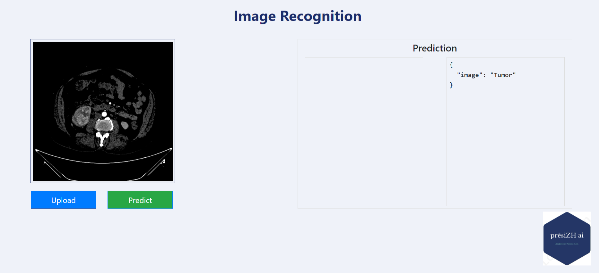

# NephroMassSorter


## Kidney Tumor Classification Using Deep Learning with MLflow, DVC, and AWS and GitHub Actions

 |  |

### Workflows
1. Update config.yaml
2. Update secrets.yaml [Optional]
3. Update params.yaml
4. Update the entity
5. Update the configuration manager in src config
6. Update the components
7. Update the pipeline
8. Update the main.py
9. Update the dvc.yaml
10. app.py

### How to run?

#### STEPS:

Clone the repository

```bash
https://github.com/presiZHai/NephroMassSorter.git
```

STEP 01- Create a conda environment after opening the repository
```bash
conda create -n nephro python=3.10 -y
```
```bash
conda activate nephro
```

STEP 02- install the requirements
```bash
pip install -r requirements.txt
```
```bash
# Finally run the following command
python app.py
```

Now,
```bash
open up the local host and port
```

### MLflow and Dagshub Integration

##### cmd

mlflow ui

##### Set mlflow_uri in the configuration.py as follows:
```bash
mlflow_uri = "https://dagshub.com/presiZHai/Kidney-Disease-Classification.mlflow"
```
##### Initialize DagsHub integration with mlflow log function in the model_evaluation_mlflow.py of components files
```bash
dagshub.init(repo_owner='presiZHai', repo_name='Kidney-Disease-Classification', mlflow=True)
```

### DVC Tracks Pipelines: Defines stages in standard YAML for easy management and consistent reproduction.
##### DVC commands
1. dvc init
2. dvc repro
3. dvc dag

### Streamlining ML Workflows: A Look at MLflow and DVC 
##### MLflow
* Production-Grade: Designed for handling the demands of real-world machine learning projects.
* Experiment Tracking: Tracks and compares all your experiments, allowing for better analysis and iteration.
* Model Logging & Tagging: Logs your models along with metadata (tags) for easy version control and retrieval.

##### DVC
* Lightweight: Ideal for proof-of-concept (POC) projects due to its low resource requirements.
* Experiment Tracking (Lite): Provides basic experiment tracking capabilities.
* Pipeline Orchestration: Can be used to create and manage data science workflows (pipelines).

### AWS-CICD-Deployment-with-Github-Actions
1. Login to AWS console.
2. Create IAM user for deployment
```bash
#with specific access
a. EC2 access : It is virtual machine
b. ECR: Elastic Container registry to save your docker image in aws

#Description: About the deployment
I. Build docker image of the source code
II. Push your docker image to ECR
III. Launch Your EC2 
IV. Pull Your image from ECR in EC2
V. Lauch your docker image in EC2

#Policy:
AmazonEC2ContainerRegistryFullAccess
AmazonEC2FullAccess
```
3. Create ECR repo to store/save docker image
```bash
- Save the URI: 819735123922.dkr.ecr.eu-west-2.amazonaws.com/kidney-tumour
```
4. Create EC2 machine (Ubuntu)
5. Open EC2 and Install docker in EC2 Machine:
```bash
#optinal
sudo apt-get update -y
sudo apt-get upgrade
#required
curl -fsSL https://get.docker.com -o get-docker.sh
sudo sh get-docker.sh
sudo usermod -aG docker ubuntu
newgrp docker
```

6. Configure EC2 as self-hosted runner:
```bash
setting>actions>runner>new self hosted runner> choose os> then run command one by one
```
7. Setup github secrets:
```bash
AWS_ACCESS_KEY_ID
AWS_SECRET_ACCESS_KEY
AWS_REGION 
AWS_ECR_LOGIN_URI 
ECR_REPOSITORY_NAME
``` 
